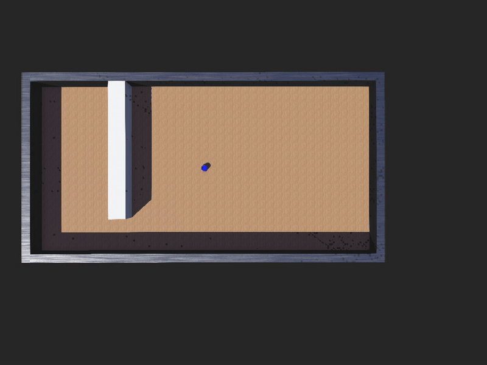

# Point Goal Navigation with PPO

This repository contains an implementation of Point Goal navigation using Proximal Policy Optimization (PPO) for a two-wheeled robot in Webots.



## Robot Description

The implementation uses a two-wheeled differential drive robot that navigates in maze environments. The robot is equipped with:

- GPS sensor for position tracking
- Compass for orientation

The robot learns to navigate efficiently to goal positions using a neural network policy trained with PPO reinforcement learning.

## Prerequisites

- Python 3.6+
- PyTorch
- NumPy
- Webots Simulator (2023b or newer)

## Installation

1. Install Webots from the [official website](https://cyberbotics.com/#download)

2. Clone this repository:
   ```bash
   git clone https://github.com/yourusername/point-goal-ppo.git
   cd point-goal-ppo
   ```

3. Install required Python packages:
   ```bash
   pip install -r requirements.txt
   ```

## Training Process

### 1. Launch Webots and Open the Training World

1. Open Webots
2. From Webots, open the training world file:
   ```
   File > Open > [path-to-repo]/worlds/train.wbt
   ```
3. The training script runs automatically, using PPO (Proximal Policy Optimization) to teach the robot navigating from point [0,0] to a point [-5,10]

Training progress will be displayed in the console with metrics including:
- Episode reward
- Success rate (percentage of successful navigation attempts)
- SPL (Success weighted by Path Length)
- Path length

### 2. Training Details

- The robot learns to navigate to randomly placed goals in the maze environment
- The policy network maps GPS coordinates and orientation to movement actions
- Reward shaping is used to encourage progress toward the goal
- Early stopping is implemented when the robot achieves a 95% success rate with 80% SPL

## Model Output

During training, models and metrics are saved automatically:

- Models are stored in a timestamped directory: `controllers/drive_robot/output/YYYYMMDD_HHMMSS/`
- The best-performing model is saved as `navigation_policy_best.pt`
- The final model is saved as `navigation_policy_final.pt`
- Training rewards are logged in `rewards.txt`

## Running the Trained Model

To run the trained navigation policy:

1. Open Webots
2. Load the run world: `File > Open > [path-to-repo]/worlds/run.wbt`
3. This automatically runs the controller script. 

## Project Structure

```
.
├── controllers/
│   ├── drive_robot/             # Training controller
│   │   ├── drive_robot.py       # Main training script
│   │   ├── maze_env.py          # Environment wrapper
│   │   └── output/              # Saved models and metrics
│   │       └── YYYYMMDD_HHMMSS/
│   │           ├── navigation_policy_best.pt
│   │           ├── navigation_policy_final.pt
│   │           └── rewards.txt
│   └── run/                     # Inference controller
│       ├── drive_robot.py       # Policy implementation
│       ├── maze_env.py          # Environment wrapper
│       └── run.py               # Inference script
├── worlds/
│   ├── train.wbt                # Training world
│   └── run.wbt                  # Evaluation world
├── protos/                      # Robot definition files
│   └── Astra.proto              # Robot model definition
├── requirements.txt             # Python dependencies
└── README.md                    # This file

## License

This project is licensed under the MIT License - see the [LICENSE](LICENSE) file for details